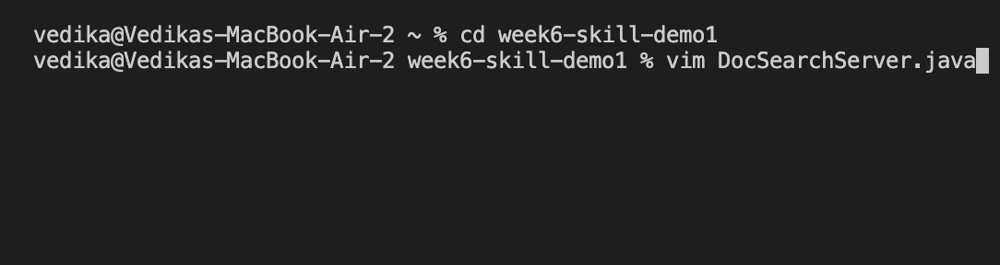
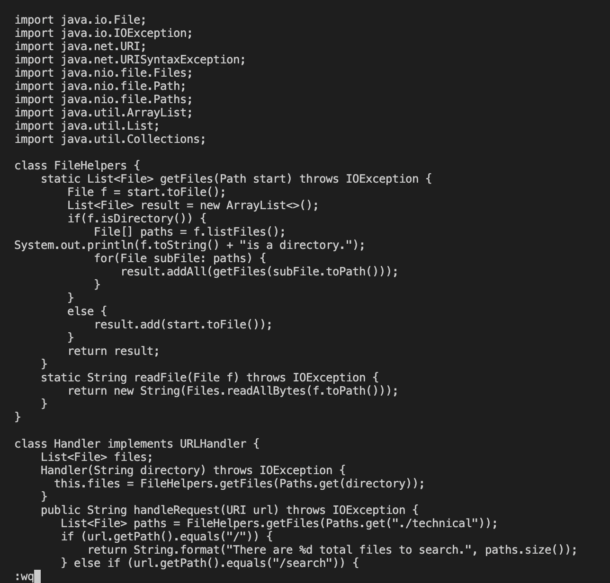

# _**LAB REPORT 4**_
### By Vedika Damani 
### PID: A16970084
---

## **Part 1**

### **Task:** Adding a new line to `print` before `File[] paths = f.listfiles()`
____

1. `cd week6-skill-demo1`

2. `Vim DocSearchServer.java` < enter >

3. `/File[] path` < enter > 
- Searches for "File[] path" and the cursor lands on the first letter, F

4. `A` < enter >
- Append at the end of the line and then < enter > to the next line

5. `System.out.println(f.toString() + “is a directory.”);` < esc > 
- Type print statement and escape from Insert Mode 

6. `:wq`
- Saves and exits the file

7. The new line to `print` has been added

_____
______

## **Part 2**

While using the first method, wherein I had to `scp` the file to the remote server after making the edit on VS Code, it took me about 190 seconds to complete the edit.

 

In the second method, when I was already logged into ssh, all I had to do was open my file in Vim and make the edit which took me about 70 seconds to complete.

 

*Which of these two styles would you prefer using if you had to work on a program that you were running remotely, and why?*
- I would prefer using the second style. It is less time consuming and works very efficiently.

 

*What about the project or task might factor into your decision one way or another? (If nothing would affect your decision, say so and why!)*
- If the project was much larger, I think I may prefer to work in VS Code first simply because I have not had much practice in Vim and as a result, don't know all the commands that make my work more efficient in it. Once I have more experience though, I think editing and running in Vim would save a lot of time as compared to the first method. 

