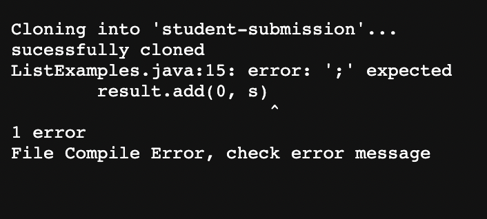
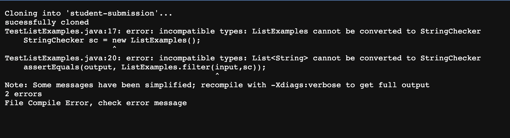
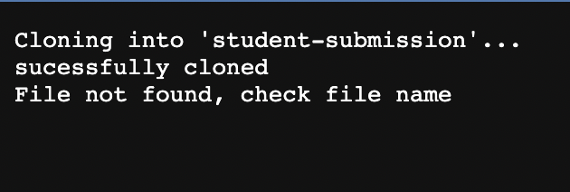

# _**LAB REPORT 5**_
### By Vedika Damani 
### PID: A16970084
---

#### Bash Script for ```grade.sh```
<br />

```

CP= ".:../lib/hamcrest-core-1.3.jar:../lib/junit-4.13.2.jar"


rm -rf student-submission
git clone $1 student-submission

echo "sucessfully cloned"

cd student-submission

if [[ ! -f ListExamples.java ]]
then
    echo "File not found, check file name"
    exit 1
fi

cd ..
cp *.java student-submission/
cp -r lib student-submission/
cd student-submission/

javac -cp $CP *.java

if [[ $? -ne 0 ]]
    then
    echo "File Compile Error, check error message"
    exit 1
fi

java -cp $CP org.junit.runner.JunitCore TestListExamples

if [[ $? -ne 0]]
then 
    echo "Tests failed"
else
    echo "All tests passed"
fi

```

Student Submissions:

1. <br />


2. <br />


3. <br />

<br />
<br />
<br />

### __Trace__:

For example 3:

This file has been saved with a wrong name but has a great implementation.
<br />
1) standard output- no 
output 
<br />
standard error- "File not found, check file name"

Here, the return code was non-zero, since exit=1
<br />
<br />

2) 

```
if [[ ! -f ListExamples.java ]]
then
    echo "File not found, check file name"
    exit 1
```
<br />


If condition- false <br />
This is because the student submission is saved with the wrong name.<br />
The exit occurs here.

<br />

```
if [[ $? -ne 0 ]]
    then
    echo "File Compile Error, check error message"
    exit 1
```

If condition- doesn't evaluate <br />
Since the student submission is saved with the wrong name, this step doesn't run. If it had run, the condition would hold true because it is mentioned that the implementation is great.

```
if [[ $? -ne 0]]
then 
    echo "Tests failed"
else
    echo "All tests passed"
```
If condition- doesn't evaluate <br />
Since the student submission is saved with the wrong name, this step doesn't run. If it had run, the condition would hold true because it is mentioned that the implementation is great.
