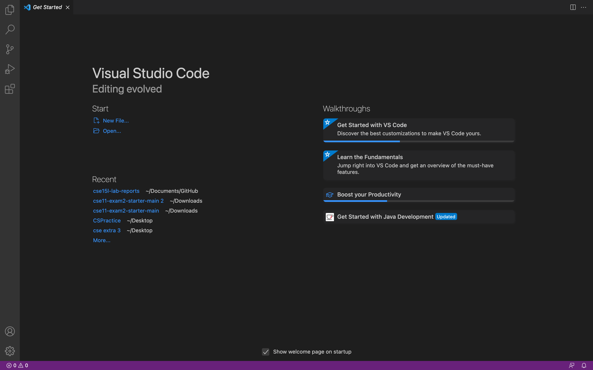
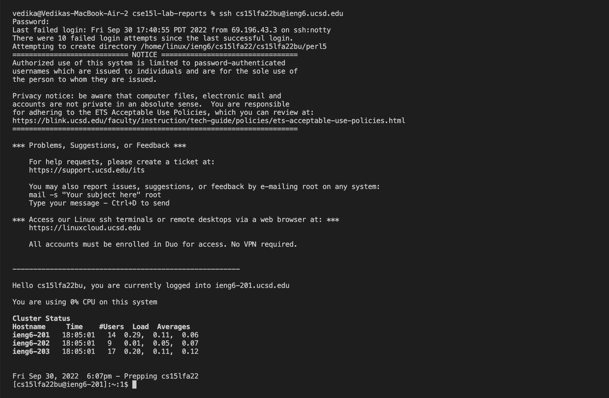
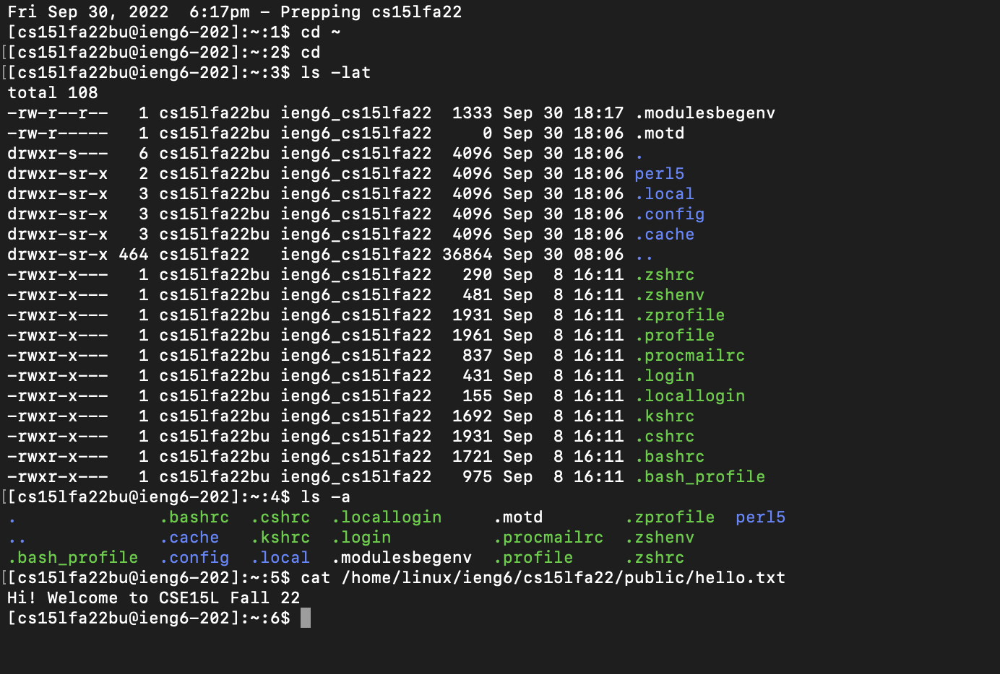
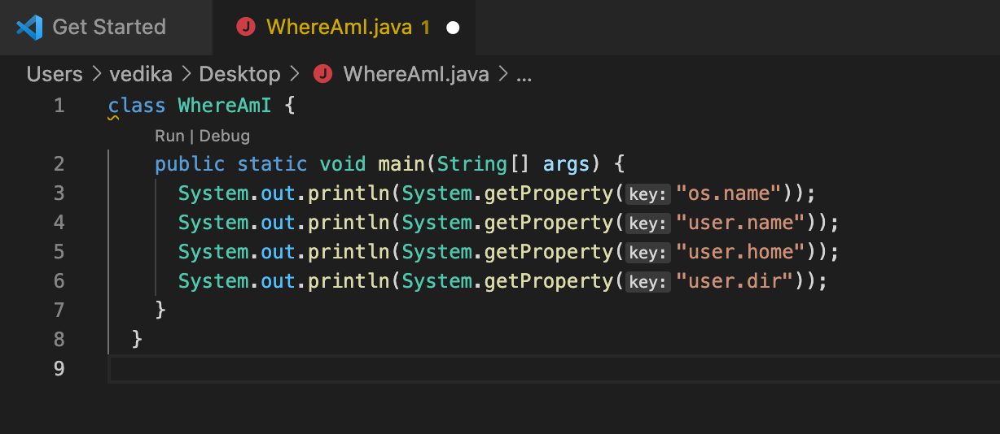
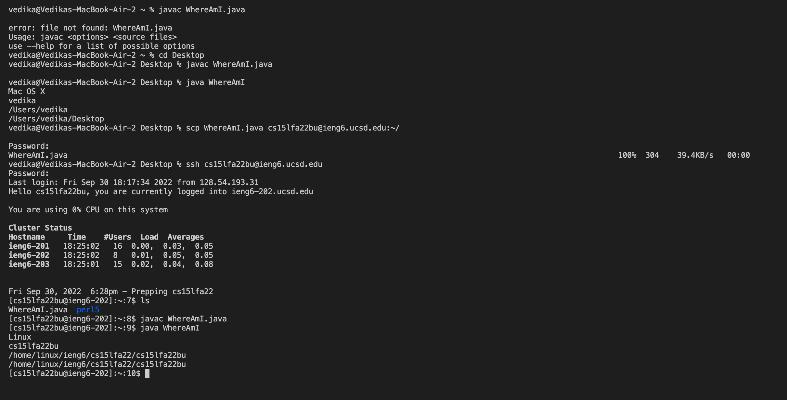
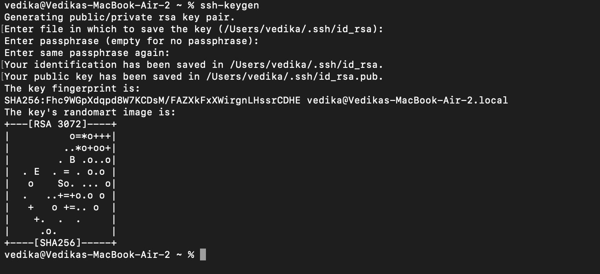
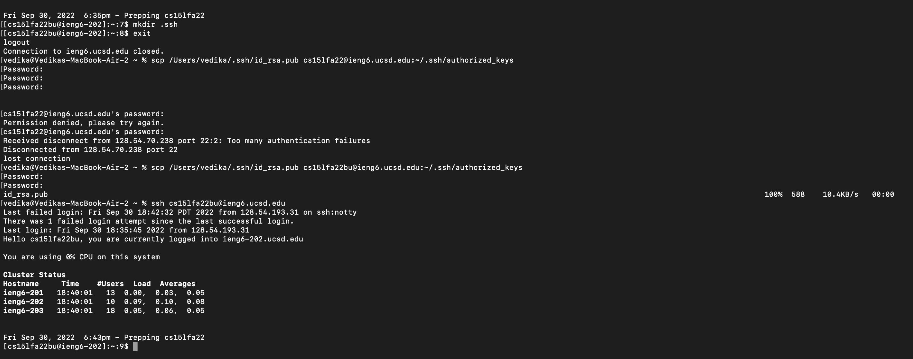
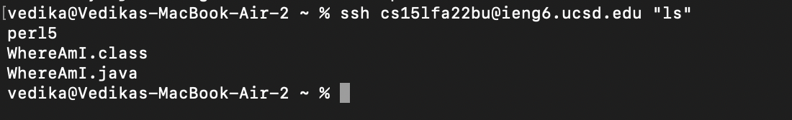

# _**LAB REPORT 1**_
### By Vedika Damani 
### PID: A16970084
---

**1. Installing VS Code**

To install VS Code, go to [Visual Studio Code](https://code.visualstudio.com/). Read the instructions to download the application and install it. You can pick whichever version is best suited for your system like OSX, Windows and Linux.

**VS Code should look like this when you install it:**

----

**2. Remotely Connecting**

CSE 15L provides its students with a course specific account where we can connect to servers remotely. This server is located in the basement of the CSE building. 

To look up the course specific account for CSE 15L, this link is to be used: [CSE 15L Course Specific Account](https://sdacs.ucsd.edu/~icc/index.php) 

To start logging into the new course specific account, we need to open a terminal and remotely connect to the server using the following command:

 
 > $ ssh cs15lfa22zz@ieng6.ucsd.edu 

 For my account, the characters 'zz' will be changed to 'bu'. 

---

**3. Trying Some Commands**

I used different commands like 'cd' and 'ls ~lat'. 'cd' changed the directory of the file. 'ls' listed the files in a particular directory.

---

**4. Moving Files with scp**

To work remotely and copy files between computers, we use the command 'scp' which is always run from _client_. 

To use this command, we will create a file on our computer like the following:

Once this is compiled and run, we will run this command again but with the username. There is a difference in locations when the command is run first and then again with the username. The first location is Mac OS X while the second one is Linux, as displayed below:

---

**5. Setting an SSH Key**

To prevent us from typing in our password every time we log in, we make use of 'ssh keys'. This creates a public key and private key which are copied to some place on the server and some place on our own computer, as shown below:

 

We copy the public key onto the server. This key is stored in a file called id_rsa.pub. It is copied on the server by doing the following: 

 

----

**6. Optimizing Remote Running** 

Now we don't require to enter a password to login which reduces a lot of time. One of the commands that I ran was:  

> $ ssh cs15lwi22@ieng6.ucsd.edu "ls"

 I started to save approximately 14 seconds during the running of the command. 

 Running now has become more efficient and fast in terms of time. 

 This one the examples that I ran using the command on the same line as the login is:- 

 

Intially the number of keystrokes were approximately **50-54**. Now, the number of key strokes now decresased. It decreased by almost  **25-30 keystrokes**.   

Hence, now it has become **9-10** key strokes and running thye command became more efficient. 

--- 

