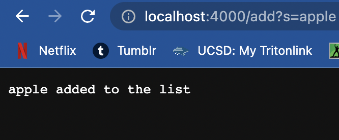

# _**LAB REPORT 2**_
### By Vedika Damani 
### PID: A16970084
---

## **Part 1**
### *Simple Search Engine*

To create the search engine, this is the code I wrote:

    import java.io.IOException;
    import java.net.URI;
    import java.util.ArrayList;

    class Handler implements URLHandler {
  
    ArrayList<String> vals = new ArrayList<>(); 

    public String handleRequest(URI url) {
        if (url.getPath().contains("/add")) {
                String[] parameters = url.getQuery().split("=");
                vals.add(parameters[1]); 
                return String.format("%s added to the list", parameters[1]);
        }

        else if(url.getPath().contains("/search")){
            String[] parameters = url.getQuery().split("=");
            ArrayList<String> toReturn = new ArrayList<>(); 
            for(String val : vals){
                if(val.contains(parameters[1])){
                    toReturn.add(val); 
                }

            }
        
            return toReturn.toString(); 

      
        } 
        return "404 Not Found!";
        
    }
    
    }

    class SearchEngine {
    public static void main(String[] args) throws IOException {
        if(args.length == 0){
            System.out.println("Missing port number! Try any number between 1024 to 49151");
            return;
        }

        int port = Integer.parseInt(args[0]);

        Server.start(port, new Handler());
    }
    }

---

### *Using the code in browser:*

Add:

In all of these screenshots:
- Methods being called: handleRequest, getQuery(), getPath(), contains()
- getPath(): returns "/add",
  getQuery(): returns "?s=apple" and "?s=pineapple"
- 'getPath()' returns a String which is the path of the URL, '/add'. 'getQuery()' returns a String that is the query, '?s=apple' and '?=pineapple'.

Search: 

- Methods being called: handleRequest, getQuery(), getPath(), contains()
- 'getPath()' returns a String '/search'.'contains()' returns a boolean value, true or false, based on whether the characters present in the String or not. In this case, it is true because it contains 'app'. 'getQuery' returns '?s=app'.

---

## **Part 2**

### *Bug 1- ArrayExamples.java*

**Failure-Inducing Input:**

**The symptom:**

**The bug fix:**

**Connection Between Symptom and Bug:**

The first method, 'reverseInPlace' required a temp variable in order to store the element of the array because of which the array was not being reversed. Thus, I created it and fixed the bug. 

---

### *Bug 2- ListExamples.java*

**Failure-Inducing Input:**

**The symptom:**

**The bug fix:**

**Connection Between Symptom and Bug:**

Due to the (0,s), the word that matches the string checker was being added at the zereoth index instead of the last index which, thus reversing the list instead of adding to it. 

